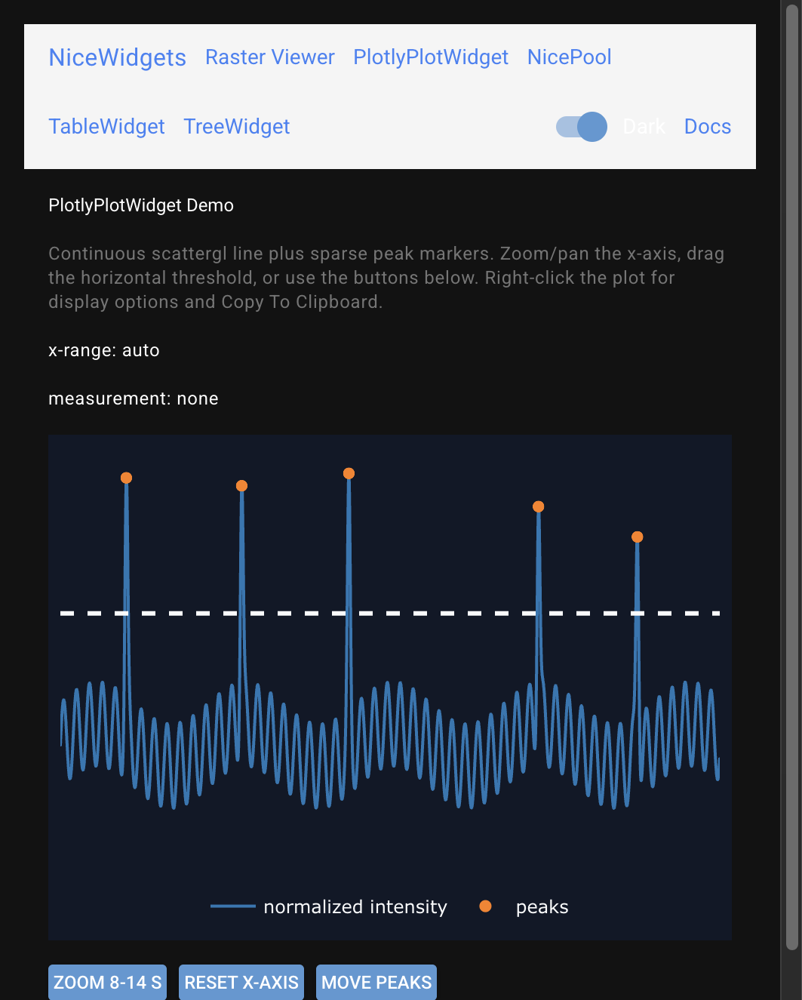

# PlotlyPlotWidget

`PlotlyPlotWidget` is a reusable scientific plot: continuous `scattergl`
traces, sparse marker overlays, editable measurement lines/pairs, x-range
callbacks, and a right-click display menu.



## Embed

```python
from nicewidgets.plotly_plot.widget import PlotlyPlotWidget
from nicewidgets.plotly_plot.display_options import PlotlyPlotDisplayOptions

plot = PlotlyPlotWidget(
    x_label='Time (s)',
    y_label='Normalized intensity',
    display_options=PlotlyPlotDisplayOptions(show_legend=True, theme='light'),
    on_x_range_changed=lambda x0, x1: print(x0, x1),
)
# Required: give the root a real height (do not leave only h-full).
plot.container.classes(remove='h-full')
plot.container.classes(add='w-full h-96')

plot.add_trace(name='signal', x=[0.0, 1.0, 2.0], y=[1.0, 1.2, 0.9])
plot.plot_scatter(name='peaks', x=[1.0], y=[1.2])
plot.add_measurement_line(name='threshold', orientation='horizontal', value=1.1)
```

X-span event overlays live on ``plot.events`` (see unit tests in
``tests/nicewidgets/test_plotly_plot_widget.py`` and the public
``PlotlyEventOverlayApi``).

Hosting height and first-navigation blank plots:
[Layout and sizing](../guide/layout-and-sizing.md).

Demo: `examples/plotly_plot/` (also `/plotly` in the combined demo).

## Configuration

`PlotlyPlotDisplayOptions` controls theme, legend, axis-label visibility,
toolbar, and hover. The widget stores a private copy; context-menu toggles
mutate that copy.

## API

::: nicewidgets.plotly_plot.widget.PlotlyPlotWidget
    options:
      show_root_heading: true
      heading_level: 3

::: nicewidgets.plotly_plot.display_options.PlotlyPlotDisplayOptions
    options:
      show_root_heading: true
      heading_level: 3
