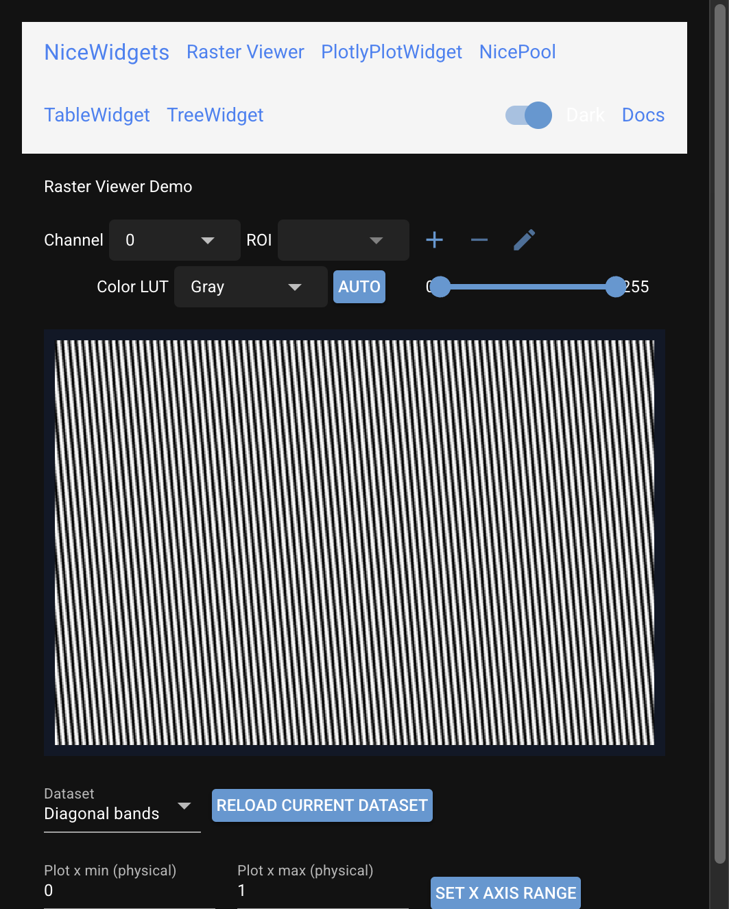

# Plotly raster viewer

This older Plotly implementation remains independently runnable and supported,
but is not mounted in the combined demo. For the primary JavaScript canvas
image viewer, see [`RasterViewerWidget`](raster_viewer_widget.md).

`PlotlyRasterViewer` displays multiresolution 2D rasters in NiceGUI with ROI and
trace overlays, contrast-friendly updates, and a built-in context menu.



## Embed

```python
import numpy as np
from nicegui import ui

from nicewidgets.raster_viewer.backend.image_model import RasterGridSpec
from nicewidgets.raster_viewer.frontend.plotly_display_options import (
    PlotlyRasterViewerDisplayOptions,
)
from nicewidgets.raster_viewer.frontend.plotly_viewer import PlotlyRasterViewer

# Tiny synthetic plane (row, col). Intensity in a simple float range.
rows, cols = 64, 128
yy, xx = np.mgrid[0:rows, 0:cols]
plane = (128.0 + 80.0 * np.sin(xx / 12.0) * np.cos(yy / 8.0)).astype(np.float32)
grid = RasterGridSpec(dx=1.0, dy=1.0, x_unit='Pixels', y_unit='Pixels')

viewer = PlotlyRasterViewer(
    display_options=PlotlyRasterViewerDisplayOptions(
        show_plotly_toolbar=False,
        show_rois=True,
        theme='light',
    ),
)
plot = viewer.build()
plot.classes('w-full h-[65vh]')

# First set_data must run after the Plotly element exists in the browser.
# Hosts typically arm a one-shot plotly_afterplot handler (see the examples demo).
async def _load(_event=None) -> None:
    await viewer.set_data(plane, grid=grid)

plot.on('plotly_afterplot', _load)
```

Size the returned Plotly element (or its parent) explicitly. See
[Layout and sizing](../guide/layout-and-sizing.md).

Demo: `examples/raster_viewer/` (also mounted at `/raster` in the combined
demo app).

## Configuration

Initial display toggles and theme are passed with
`PlotlyRasterViewerDisplayOptions`. Runtime toggles are also available on the
viewer (toolbar, ROIs, axis labels, dark mode).

## API

::: nicewidgets.raster_viewer.frontend.plotly_viewer.PlotlyRasterViewer
    options:
      show_root_heading: true
      heading_level: 3

::: nicewidgets.raster_viewer.frontend.plotly_display_options.PlotlyRasterViewerDisplayOptions
    options:
      show_root_heading: true
      heading_level: 3
