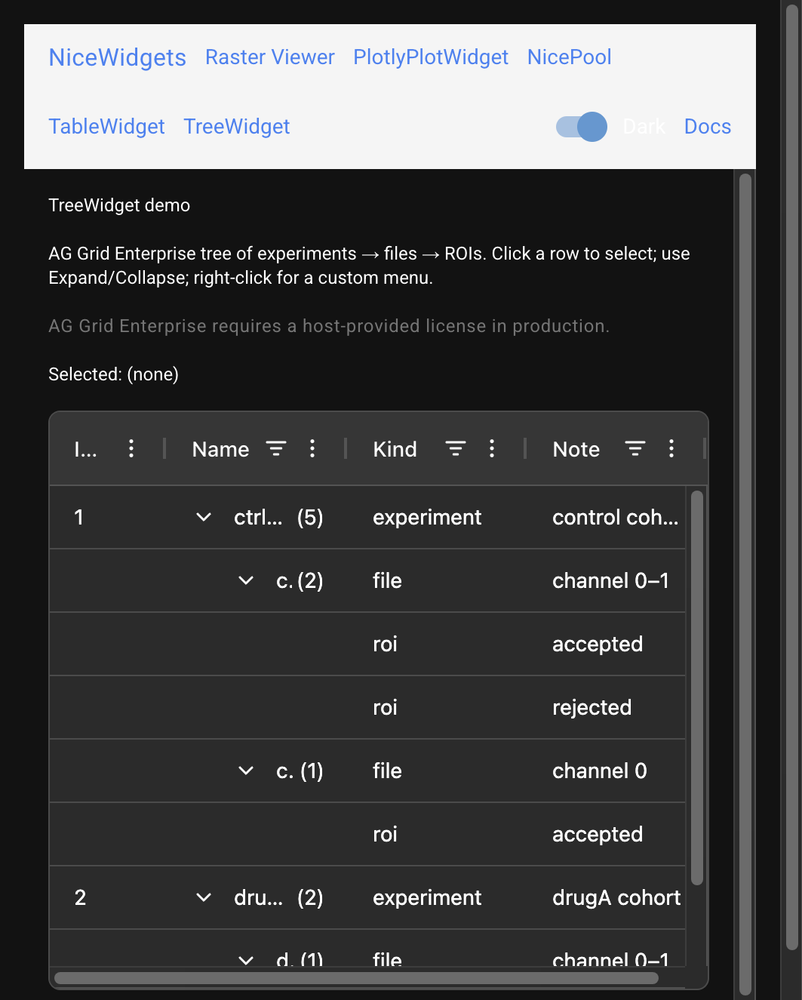

# TreeWidget

`TreeWidget` is an AG Grid Enterprise tree wrapper with a TableWidget-like
public surface: stable row ids, selection, context menus, and expand/collapse
helpers. Inline cell editing is not part of the v1 surface.



## Embed

```python
from nicegui import ui
from nicewidgets.aggrid_common.column_def import ColumnDef
from nicewidgets.tree_widget.config import TreeWidgetConfig
from nicewidgets.tree_widget.tree_widget import TreeWidget

tree = TreeWidget(
    [
        ColumnDef(field='name', headerName='Name'),
        ColumnDef(field='kind', headerName='Kind'),
    ],
    'id',
    [
        {
            'id': 'root',
            'name': 'Experiment',
            'kind': 'folder',
            'hierarchy_path': ['Experiment'],
        },
        {
            'id': 'child',
            'name': 'roi-1',
            'kind': 'roi',
            'hierarchy_path': ['Experiment', 'roi-1'],
        },
    ],
    path_field='hierarchy_path',
    config=TreeWidgetConfig(selection_mode='single', show_index_column=True),
    on_row_selected=lambda row: print(row),
)
with ui.column().classes('w-full').style('height: 24rem;'):
    tree.build()
tree.set_dark_mode(False)
```

Rows must include a list path at `path_field` (default `hierarchy_path`). Size
the `build()` parent explicitly — see
[Layout and sizing](../guide/layout-and-sizing.md).

Theme: `set_theme` / `set_dark_mode` set AG Grid `data-ag-theme-mode`.

Demo: `examples/tree_widget/` (also `/tree` in the combined demo).

## Configuration

`TreeWidgetConfig` mirrors the relevant table options (selection, fonts,
heights, index column, Enterprise module URL). Editing flags from the table
config are intentionally omitted.

## API

::: nicewidgets.tree_widget.tree_widget.TreeWidget
    options:
      show_root_heading: true
      heading_level: 3

::: nicewidgets.tree_widget.config.TreeWidgetConfig
    options:
      show_root_heading: true
      heading_level: 3
